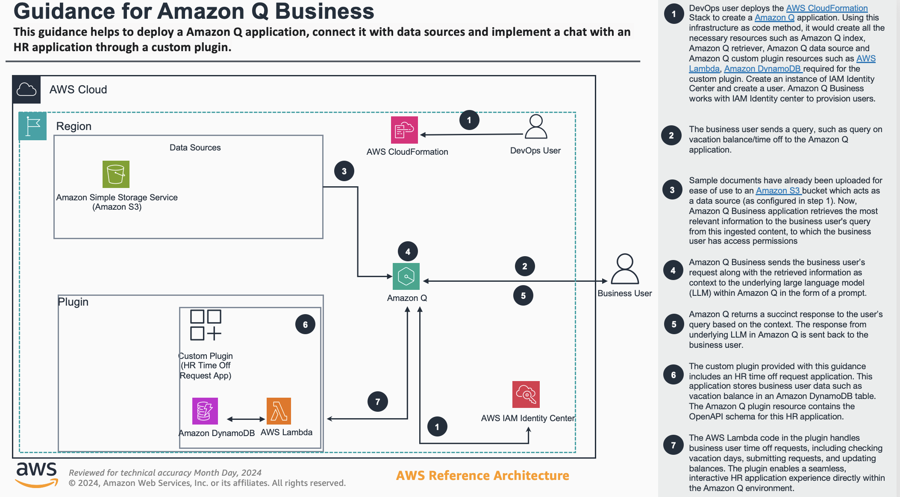

# Guidance for Amazon Q Business

This guidance helps to create a Amazon Q application, connect with data sources and have a chat with a HR application through a custom plugin.

## Table of Contents 

1. [Overview](#overview)
    - [Cost](#cost)
2. [Prerequisites](#prerequisites)
    - [Operating System](#operating-system)
3. [Deployment Steps](#deployment)
4. [Deployment Validation](#deployment)
5. [Running the Guidance](#running-the-guidance)
6. [Next Steps](#next-steps)
7. [Cleanup](#cleanup)

## Overview

This guidance aims to showcase how to build an end-to-end business application using Amazon Q, a conversational AI assistant, along with AWS services like CloudFormation, DynamoDB, and Lambda. It demonstrates the integration of Amazon Q to retrieve relevant information, pass it to a language model, and return a response. The guidance also uses Infrastructure as Code to manage the application's resources and includes a sample HR time-off request application built using the Amazon Q custom plugin. The key objective is to provide a blueprint for developers to build conversational AI-powered business applications, leveraging the capabilities of Amazon Q and the AWS ecosystem.



### Cost 
You are an enterprise company with 5,000 employees looking to deploy Amazon Q Business. You decide to purchase Amazon Q Business Lite for 4,500 users and Amazon Q Business Pro for 500 users. You have 1 million enterprise documents across sources like SharePoint, Confluence, and ServiceNow that need indexing with an Enterprise Index. Your monthly charges will be as follows:
Enterprise Index for 1M documents will need 50 index units of 20K capacity each (assuming that the extracted text size of 1M documents is less than 200 MB * 50 units = 10 GB) :
* $0.264 per hour * 50 units * 24 hours * 30 days = $9,504
User subscriptions:
* 4,500 users * $3 per user/month = $13,500 
* 500 users * $20 per user/month = $10,000
* Total user subscriptions: $23,500
In summary, your monthly charges are as follows::
* Enterprise Index: $9,504
* User subscriptions: $23,500
* Total per month: $33,004


### Sample Cost Table 


## Prerequisites 
- AWS Account that you have admin access.
-  An instance of IAM Identity Center and note down the ARN. Enabled an IAM Identity Center instance, provisioned at least one user, and provided each user with a valid email address. (https://docs.aws.amazon.com/amazonq/latest/qbusiness-ug/idp-sso.html)

### Operating System 

Any operating system can be used.

### AWS account requirements

This deployment requires you have a Amazon S3 bucket in your AWS account.

**Resources:**
- S3 bucket with folders names  **HR**, **Finance**, **Legal**, **Marketing**, **Sales**
- Once the folders are created, you can ingest some sample documents into each folder.


### Supported Regions 

This guidance applies for all regions where Amazon Q for Business is vaialble. Please check here for availability in your region. https://aws.amazon.com/about-aws/global-infrastructure/regional-product-services/


## Deployment Steps

**Step 01**
Clone the repository ```git clone https://github.com/aws-solutions-library-samples/guidance-for-amazon-q-business ```

**Step 02**

- In AWS Cloudformtaion in the console, create a stack and upload the template Q-HRplugin.yaml that can be found under deployment folder. Once deployment is complete, you can get the **ApiEndpoint** from the **Outputs** tab of the stack.
- Once the deployment is complete for the above stack, create a new stack and upload the template Q-App.yaml that can be found under deployment folder.
- For the paramters, enter the **ApiEndpoint**, name of the S3 bucket you had previously created and provide under **S3BucketName** and the arn of the IDC instance in **IdentityCenterInstanceArn**

**Step 03**
- Create a user in IAM Identity Center. (https://docs.aws.amazon.com/amazonq/latest/qbusiness-ug/idp-sso.html)

**Step 04**

- For **Sync Mode** choose **Full Sync**
  
## Deployment Validation  

* Open CloudFormation console and verify the status of the 2 template to be **CREATE_COMPLETE**
* If deployment is successful, you should see an active Amazon Q application in the console.

## Running the Guidance 

In the newly created Amazon Q appplication, you can now run queries such as 
- "What is my vacation balance?"

## Next Steps 

You can ingest other documents in S3 or connect to other data sources, to your newly created Amazon Q application.


## Cleanup 

Delete the two stacks in Cloudformation and make sure that Amazon Q application has been deleted in the console.

## Notices 

*Customers are responsible for making their own independent assessment of the information in this Guidance. This Guidance: (a) is for informational purposes only, (b) represents AWS current product offerings and practices, which are subject to change without notice, and (c) does not create any commitments or assurances from AWS and its affiliates, suppliers or licensors. AWS products or services are provided “as is” without warranties, representations, or conditions of any kind, whether express or implied. AWS responsibilities and liabilities to its customers are controlled by AWS agreements, and this Guidance is not part of, nor does it modify, any agreement between AWS and its customers.*

